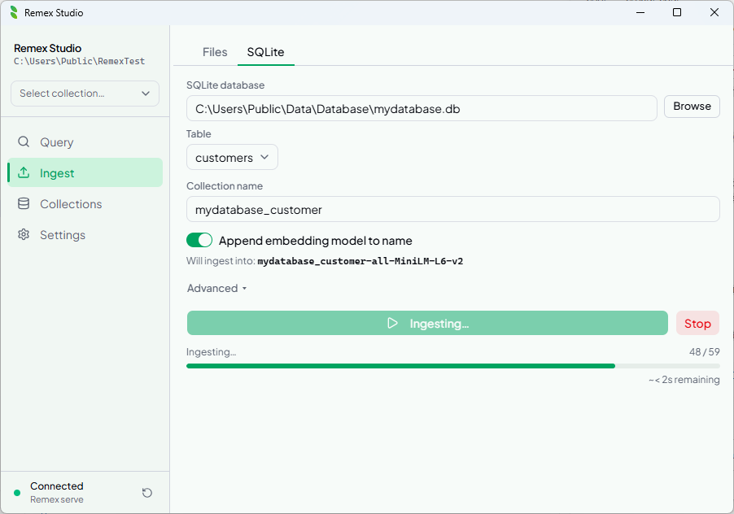

<div align="center">

  <br/><br/>

  # remex

  **Your private knowledge base — fully offline, never leaves your machine.**

  <br/>


[](https://github.com/adm-crow/remex/releases)


  <br/>

  

</div>

---

Remex turns any folder of documents — PDFs, notes, code, spreadsheets — into a searchable knowledge base. Ask questions in natural language and get answers grounded in your own files.

Everything runs locally. No cloud account. No data leaves your machine. Bring your own AI provider (Anthropic, OpenAI, or a local Ollama) only when you want AI-synthesised answers.

---

## Remex Studio

Native desktop app for Windows — ingest, search, and query your documents with AI. No terminal required.

**[Download the latest release →](https://github.com/adm-crow/remex/releases)**

<div align="center">
  <table>
    <tr>
      <td align="center">
        <a href="docs/screenshots/remex_query.png">
          
        </a><br/>
        <em>Semantic search</em>
      </td>
      <td align="center">
        <a href="docs/screenshots/remex_ai_answer.png">
          
        </a><br/>
        <em>AI answer, grounded in your files</em>
      </td>
    </tr>
    <tr>
      <td align="center">
        <a href="docs/screenshots/remex_ingest.png">
          
        </a><br/>
        <em>Ingest any folder</em>
      </td>
      <td align="center">
        <a href="docs/screenshots/remex_ingest_sqlite.png">
          
        </a><br/>
        <em>…or a SQLite table</em>
      </td>
    </tr>
    <tr>
      <td align="center">
        <a href="docs/screenshots/remex_collection.png">
          
        </a><br/>
        <em>Manage collections</em>
      </td>
      <td align="center">
        <a href="docs/screenshots/remex_settings.png">
          
        </a><br/>
        <em>Themes · AI provider · more</em>
      </td>
    </tr>
  </table>
</div>

> Building from source? See [`studio/README.md`](studio/README.md).

---

## Python CLI

```bash
pip install remex-cli          # core — ingest + query
pip install remex-cli[api]     # adds the FastAPI sidecar (used by Studio)
```

### Quick start

```bash
remex init                                # scaffold docs/ + remex.toml
remex ingest docs/                        # ingest a folder
remex query "how does auth work?"         # semantic search
remex query "how does auth work?" --ai    # AI answer
```

### All commands

| Command | Description |
|:---|:---|
| `remex init [path]` | Scaffold `docs/`, `remex.toml`, and `.gitignore` |
| `remex ingest [dir]` | Ingest files from a directory |
| `remex ingest-sqlite <db>` | Ingest rows from a SQLite table |
| `remex query <text>` | Semantic search (add `--ai` for AI answer) |
| `remex sources` | List all ingested source paths |
| `remex stats` | Show chunk/source counts for a collection |
| `remex delete-source <path>` | Remove all chunks for a source |
| `remex purge` | Remove chunks whose source file no longer exists |
| `remex reset` | Wipe an entire collection |
| `remex list-collections` | List all collections in a database |
| `remex serve` | Start the FastAPI sidecar (used by Studio) |

Use `remex <command> --help` for the full option reference.

---

## Features

- **Fully offline** — local embeddings, local storage, no telemetry
- **12 file formats** — `.pdf` `.docx` `.md` `.txt` `.csv` `.json` `.jsonl` `.html` `.pptx` `.xlsx` `.epub` `.odt`
- **SQLite ingest** — embed rows from any table alongside your files
- **Incremental ingest** — SHA-256 hash check skips unchanged files
- **AI answers** — auto-detects Anthropic, OpenAI, or a local Ollama
- **Multi-collection search** — query across collections, merged by score
- **Source filtering & export** — narrow to a file, copy or export results
- **Collections manager** — rename, delete, inspect from the UI
- **Keyboard-driven** — press `?` in Studio for the shortcuts reference

---

## Configuration

Drop a `remex.toml` in your project root (created by `remex init`):

```toml
[remex]
db              = "./remex_db"
collection      = "remex"
embedding_model = "all-MiniLM-L6-v2"

# chunk_size     = 1000
# overlap        = 200
# min_chunk_size = 50
# chunking       = "word"   # "word" or "sentence"
```

CLI flags always override `remex.toml`.

---

<div align="center">
  <sub>
    <a href="CHANGELOG.md">Changelog</a> ·
    <a href="CONTRIBUTING.md">Contributing</a> ·
    <a href="LICENSE">Apache 2.0</a> ·
    <a href="https://github.com/adm-crow/remex">GitHub</a>
  </sub>
</div>
