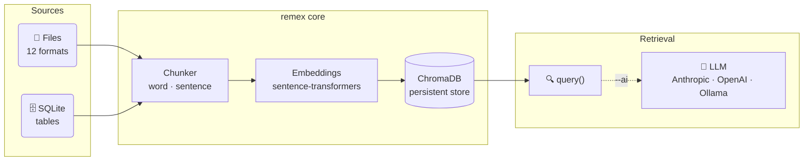

<div align="center">
  <br/><br/>

  # remex

  **Local-first RAG for Python — ingest files, query semantically, feed any AI.**

  <br/>

  [](https://pypi.org/project/remex/)
  [](https://pypi.org/project/remex/)
  [](LICENSE)
  [](https://pypi.org/project/remex/)
  <br/>
  [](https://github.com/adm-crow/remex/actions)
  [](https://github.com/adm-crow/remex/releases)

</div>

---

No cloud. No API key. No infrastructure.

Point remex at a folder — or a SQLite database — and semantically search your documents in minutes, entirely on your machine. Pipe the results into any LLM or use the built-in `--ai` flag for instant AI answers.

---

## How it works



---

## Features

| | |
|:---|:---|
| **12 file formats** | `.txt` `.md` `.csv` `.pdf` `.docx` `.json` `.jsonl` `.html` `.pptx` `.xlsx` `.epub` `.odt` |
| **Fully offline** | Local `sentence-transformers` — no data leaves your machine |
| **Persistent storage** | ChromaDB vector store — survives restarts, idempotent upserts |
| **Incremental ingest** | SHA-256 hash check — skip unchanged files on every re-run |
| **Streaming** | Large files paged through the chunker — memory stays flat at any scale |
| **SQLite ingest** | Embed table rows alongside files in the same collection |
| **Multi-collection query** | Query several collections at once, results merged by score |
| **Async API** | Drop-in `ingest_async()` / `query_async()` for FastAPI and async frameworks |
| **AI answers** | `--ai` flag auto-detects Anthropic, OpenAI, or a local Ollama instance |
| **FastAPI sidecar** | `remex serve` starts a REST/SSE server for any client app |
| **Desktop GUI** | Remex Studio — native Tauri v2 desktop app (see `studio/`) |
| **Typed API** | Full `py.typed` marker — Pylance and mypy resolve every type |

---

## Install

```bash
pip install remex
# or
uv add remex
```

<details>
<summary>Optional extras</summary>

```bash
pip install "remex[formats]"   # .html .pptx .xlsx .epub .odt support
pip install "remex[sentence]"  # sentence-aware chunking (requires NLTK)
pip install "remex[ai]"        # Anthropic + OpenAI SDKs for --ai flag
pip install "remex[api]"       # FastAPI sidecar (remex serve)
pip install "remex[all]"       # everything
```

</details>

---

## Quick start

```python
from remex import ingest, query

# Index a folder (idempotent — safe to re-run)
result = ingest("./docs")
print(f"{result.sources_ingested} files ingested, {result.chunks_stored} chunks stored")

# Semantic search
hits = query("what is the refund policy?", n_results=4)
for hit in hits:
    print(f"[{hit['score']:.2f}]  {hit['source']}")
    print(hit["text"])
```

> [!TIP]
> `ingest()` upserts — duplicates are never created. Pass `incremental=True` to skip files whose content hasn't changed since the last run (SHA-256 check).

---

## CLI

```bash
# One-time setup
remex init                                        # scaffold docs/, remex.toml, .gitignore

# Ingest
remex ingest ./docs
remex ingest ./docs --incremental                 # skip unchanged files
remex ingest ./docs --chunking sentence           # sentence-aware splitting

# SQLite
remex ingest-sqlite ./data.db --table articles
remex ingest-sqlite ./data.db --table articles --columns "title,body"
remex ingest-sqlite ./data.db --table articles --row-template "{title}: {body}"

# Query
remex query "refund policy"
remex query "..." -n 10 --format json
remex query "..." --collections "docs,archive"
remex query "..." --where '{"source_type": {"$eq": "file"}}'
remex query "..." --ai                            # AI answer, provider auto-detected
remex query "..." --ai --provider anthropic --model claude-opus-4-6

# Collection management
remex sources                                     # list all indexed sources
remex purge                                       # remove chunks from deleted files
remex reset --yes                                 # wipe the entire collection

# Sidecar
remex serve                                       # start the FastAPI server (requires remex[api])
```

> [!NOTE]
> Every command accepts `--db PATH`, `--collection NAME`, and `--embedding-model`.
> Run `remex <cmd> --help` for all options.

<details>
<summary>Full CLI flag reference</summary>

**`remex ingest [SOURCE_DIR]`**
```
  SOURCE_DIR                         Directory to scan recursively [default: ./docs]
  --db PATH                          ChromaDB persistence path [default: ./remex_db]
  --collection NAME                  Collection name [default: remex]
  --chunk-size INT                   Target characters per chunk [default: 1000]
  --overlap INT                      Character overlap between chunks [default: 200]
  --min-chunk-size INT               Discard chunks shorter than this [default: 50]
  --chunking [word|sentence]         Chunking strategy [default: word]
  --streaming-threshold INT          Stream files larger than N MB [default: 50]; 0 = off
  --embedding-model MODEL            SentenceTransformer model name
  --incremental                      Skip files unchanged since last run (SHA-256)
```

**`remex ingest-sqlite DB_PATH --table TABLE`**
```
  DB_PATH                            Path to the SQLite database file
  --table NAME              *        Table to ingest (required)
  --db PATH                          ChromaDB persistence path [default: ./remex_db]
  --collection NAME                  Collection name [default: remex]
  --columns col1,col2                Columns to embed (default: all columns)
  --id-column NAME                   Primary key column [default: id]
  --row-template STR                 Row format string, e.g. "{title}: {body}"
  --chunk-size INT                   Target characters per chunk [default: 1000]
  --overlap INT                      Character overlap between chunks [default: 200]
  --min-chunk-size INT               Discard chunks shorter than this [default: 50]
  --chunking [word|sentence]         Chunking strategy [default: word]
  --embedding-model MODEL            SentenceTransformer model name
```

**`remex query TEXT`**
```
  TEXT                               Search query (required)
  --db PATH                          ChromaDB persistence path [default: ./remex_db]
  --collection NAME                  Collection name [default: remex]
  -n, --n-results INT                Number of results [default: 5]
  --min-score FLOAT                  Minimum relevance score 0–1 to include a result
  --embedding-model MODEL            SentenceTransformer model (must match ingest)
  --where JSON                       ChromaDB metadata filter as JSON
  --collections col1,col2            Query multiple collections, merge by score
  --format [text|json]               Output format [default: text]
  --ai                               Generate an AI answer from retrieved chunks
  --provider [anthropic|openai|ollama]
  --model NAME                       Model override (e.g. gpt-4o, llama3)
```

**`remex serve`**
```
  --host TEXT                        Bind host [default: 127.0.0.1]
  --port INT                         Bind port [default: 8000]
  --reload                           Enable auto-reload (dev only)
```

</details>

---

## Python API

<details>
<summary><strong>ingest()</strong> — scan a directory and embed all supported files</summary>

```python
from remex import ingest

result = ingest(
    source_dir          = "./docs",
    db_path             = "./remex_db",
    collection_name     = "remex",
    chunk_size          = 1000,
    overlap             = 200,
    min_chunk_size      = 50,
    embedding_model     = "all-MiniLM-L6-v2",
    incremental         = False,
    chunking            = "word",              # "word" or "sentence"
    streaming_threshold = 50 * 1024 * 1024,   # stream files > N bytes; 0 = disable
    verbose             = True,
    on_progress         = None,                # Callable[[IngestProgress], None]
)
```

Raises `SourceNotFoundError` if `source_dir` does not exist.

**Progress callback with tqdm:**

```python
from tqdm import tqdm
from remex import ingest, IngestProgress

with tqdm(unit="file") as bar:
    def on_progress(p: IngestProgress) -> None:
        bar.total = p.files_total
        bar.update(1)
        bar.set_postfix(file=p.filename, status=p.status)

    ingest("./docs", on_progress=on_progress)
```

</details>

<details>
<summary><strong>query()</strong> — embed and search the closest matching chunks</summary>

```python
from remex import query

hits = query(
    text             = "what is the refund policy?",
    db_path          = "./remex_db",
    collection_name  = "remex",
    n_results        = 5,
    min_score        = None,                   # float 0–1 — filter low-relevance results
    embedding_model  = "all-MiniLM-L6-v2",
    where            = None,                   # ChromaDB metadata filter dict
    collection_names = None,                   # list → query all, merge by score
)
```

Raises `CollectionNotFoundError` in single-collection mode. Missing collections are silently skipped in multi-collection mode.

```python
# Filter examples
hits = query("...", where={"source_type": {"$eq": "file"}})
hits = query("...", where={"source": {"$eq": "/abs/path/to/report.pdf"}})
hits = query("...", collection_names=["docs", "archive", "notes"])
hits = query("...", min_score=0.55)
```

Supported `where` operators: `$eq` `$ne` `$gt` `$gte` `$lt` `$lte` `$in` `$nin`

</details>

<details>
<summary><strong>ingest_sqlite()</strong> — embed rows from a SQLite table</summary>

```python
from remex import ingest_sqlite

result = ingest_sqlite(
    db_path         = "./data.db",
    table           = "articles",
    columns         = None,           # list of columns; None = all
    id_column       = "id",           # primary key for stable chunk IDs
    row_template    = None,           # e.g. "{title}: {body}"
    chroma_path     = "./remex_db",
    collection_name = "remex",
    chunk_size      = 1000,
    overlap         = 200,
    min_chunk_size  = 50,
    embedding_model = "all-MiniLM-L6-v2",
    chunking        = "word",
    verbose         = True,
    on_progress     = None,
)
```

If `id_column` is absent from the table, SQLite's built-in `rowid` is used automatically.
Rows without a `row_template` are serialised as `"col1: val1 | col2: val2 | ..."`.

Raises `SourceNotFoundError` · `TableNotFoundError` · `ValueError` (bad column names).

</details>

<details>
<summary><strong>ingest_many()</strong> — ingest an explicit list of files</summary>

```python
from remex import ingest_many

result = ingest_many(
    paths               = ["./a.pdf", "./reports/q1.docx"],
    db_path             = "./remex_db",
    collection_name     = "remex",
    chunk_size          = 1000,
    overlap             = 200,
    min_chunk_size      = 50,
    embedding_model     = "all-MiniLM-L6-v2",
    chunking            = "word",
    verbose             = True,
    incremental         = False,
    streaming_threshold = 50 * 1024 * 1024,
    on_progress         = None,
)
```

Unsupported or missing files are skipped — reasons recorded in `result.skipped_reasons`.

</details>

<details>
<summary><strong>Async API</strong> — drop-in async wrappers</summary>

`ingest_async()` and `query_async()` are backed by `asyncio.to_thread()`. All parameters are identical.

```python
from remex import ingest_async, query_async

async def main():
    result = await ingest_async("./docs", incremental=True)
    hits   = await query_async("refund policy", n_results=3)
```

**FastAPI integration:**

```python
from fastapi import FastAPI
from remex import ingest_async, query_async

app = FastAPI()

@app.post("/ingest")
async def ingest_endpoint(path: str):
    result = await ingest_async(source_dir=path)
    return {"ingested": result.sources_ingested, "chunks": result.chunks_stored}

@app.get("/search")
async def search_endpoint(q: str, n: int = 5):
    return await query_async(q, n_results=n)
```

</details>

<details>
<summary><strong>purge() · reset() · sources()</strong> — collection management</summary>

```python
from remex import purge, reset, sources

# List all indexed source paths
paths = sources(db_path="./remex_db", collection_name="remex")

# Remove chunks whose source file no longer exists on disk
result = purge(db_path="./remex_db", collection_name="remex")
print(f"Deleted {result.chunks_deleted} stale chunk(s) from {result.chunks_checked} checked")

# Wipe the entire collection — confirm=True is required
reset(db_path="./remex_db", collection_name="remex", confirm=True)
```

> [!WARNING]
> `reset()` raises `ValueError` unless `confirm=True` is explicitly passed.

**Logging:**

```python
import remex

remex.setup_logging()                        # coloured console output
remex.setup_logging(log_file="ingest.log")   # also write to a file
remex.setup_logging(level=logging.WARNING)   # suppress info messages
```

</details>

---

## remex.toml

Run `remex init` once per project to scaffold the config file. CLI flags always override.

```toml
[remex]
db              = "./remex_db"
collection      = "myproject"
embedding_model = "all-MiniLM-L6-v2"

# chunk_size     = 1000
# overlap        = 200
# min_chunk_size = 50
# chunking       = "word"     # "word" or "sentence"
```

---

## Use with any LLM

```python
from remex import ingest, query

ingest("./docs")   # run once — idempotent

def ask(question: str, client) -> str:
    context = "\n\n".join(r["text"] for r in query(question, n_results=5))
    return client.messages.create(
        model   = "claude-opus-4-6",
        max_tokens = 1024,
        system  = f"Answer using only the context below:\n\n{context}",
        messages = [{"role": "user", "content": question}],
    ).content[0].text
```

Or zero-code from the CLI — set `ANTHROPIC_API_KEY` / `OPENAI_API_KEY` and use `--ai`:

```bash
remex query "what changed in v2?" --ai
```

---

## Reference

<details>
<summary>Return types</summary>

**`IngestResult`** — returned by `ingest()`, `ingest_many()`, `ingest_sqlite()`

| Field | Type | Description |
| :---- | :--- | :---------- |
| `sources_found` | `int` | Files or rows discovered |
| `sources_ingested` | `int` | Successfully chunked and stored |
| `sources_skipped` | `int` | Skipped: empty, extract error, or hash unchanged |
| `chunks_stored` | `int` | Total chunks written to ChromaDB |
| `skipped_reasons` | `list[str]` | Human-readable reason per skip, e.g. `"doc.txt: empty"` |

**`PurgeResult`** — returned by `purge()`

| Field | Type | Description |
| :---- | :--- | :---------- |
| `chunks_deleted` | `int` | Chunks removed from ChromaDB |
| `chunks_checked` | `int` | Total chunks scanned |

**`IngestProgress`** — received by the `on_progress` callback

| Field | Type | Description |
| :---- | :--- | :---------- |
| `filename` | `str` | Base name of the file just processed |
| `files_done` | `int` | Files processed so far (including this one) |
| `files_total` | `int` | Total supported files found |
| `status` | `"ingested" \| "skipped" \| "error"` | Outcome for this file |
| `chunks_stored` | `int` | Cumulative chunks written in this run |

**`QueryResult`** — each item returned by `query()`

| Field | Type | Description |
| :---- | :--- | :---------- |
| `text` | `str` | Chunk content |
| `source` | `str` | Absolute file path, or `/path/to/db.db::table` for SQLite |
| `source_type` | `str` | `"file"` or `"sqlite"` |
| `score` | `float` | Relevance 0–1 (higher = better) |
| `distance` | `float` | Raw ChromaDB L2 distance (lower = closer) |
| `chunk` | `int` | Chunk index within the source |
| `doc_title` | `str` | Extracted title (empty string if unavailable) |
| `doc_author` | `str` | Extracted author (empty string if unavailable) |
| `doc_created` | `str` | ISO-8601 creation date (empty string if unavailable) |

</details>

<details>
<summary>Exceptions</summary>

```
RemexError                      ← base class, catch-all
├── SourceNotFoundError         ← also FileNotFoundError
├── CollectionNotFoundError     ← also ValueError
└── TableNotFoundError          ← also ValueError
```

Every exception inherits from both `RemexError` and the matching Python built-in — existing `except ValueError` / `except FileNotFoundError` handlers keep working unchanged.

</details>

<details>
<summary>Metadata extraction</summary>

| Format | Title | Author | Date |
| :----- | :---: | :----: | :--: |
| PDF | ✅ | ✅ | ✅ |
| DOCX | ✅ | ✅ | ✅ |
| HTML | ✅ | ✅ | ✅ |
| PPTX | ✅ | ✅ | ✅ |
| EPUB | ✅ | ✅ | ✅ |
| ODT | ✅ | ✅ | ✅ |
| TXT / MD / CSV / JSON / JSONL / XLSX | — | — | — |

All fields are always present in `QueryResult` — empty string when unavailable.

</details>

<details>
<summary>Chunking modes</summary>

| Mode | Flag | Extra | Description |
| :--- | :--- | :---- | :---------- |
| **word** | `--chunking word` | *(none)* | Default. Splits on whitespace boundaries. Fast, works for all formats. |
| **sentence** | `--chunking sentence` | `remex[sentence]` | Splits on sentence boundaries using NLTK. Better retrieval precision for prose. |

Chunks shorter than `min_chunk_size` (default 50 chars) are discarded. Consecutive chunks overlap by `overlap` characters (default 200) to preserve context at boundaries.

Files exceeding `streaming_threshold` (default 50 MB) are paged through the chunker — memory stays flat regardless of file size.

</details>

<details>
<summary>AI providers</summary>

`--ai` and `generate_answer()` auto-detect the provider in priority order:

| Priority | Provider | Activation | Default model |
| :------- | :------- | :--------- | :------------ |
| 1 | **Anthropic** | `ANTHROPIC_API_KEY` set | `claude-sonnet-4-6` |
| 2 | **OpenAI** | `OPENAI_API_KEY` set | `gpt-4o` |
| 3 | **Ollama** | Local server at `http://localhost:11434` | `llama3` |

Override with `--model NAME`. The AI answer is generated from retrieved chunks only — your full corpus is never sent to any provider.

```bash
# Ollama (fully local, no API key)
ollama serve
ollama pull llama3
remex query "..." --ai --provider ollama --model llama3
```

</details>

---

<div align="center">
  <sub>
    <a href="CHANGELOG.md">Changelog</a> ·
    <a href="LICENSE">Apache 2.0</a> ·
    <a href="https://pypi.org/project/remex/">PyPI</a> ·
    <a href="https://github.com/adm-crow/remex">GitHub</a>
  </sub>
</div>
