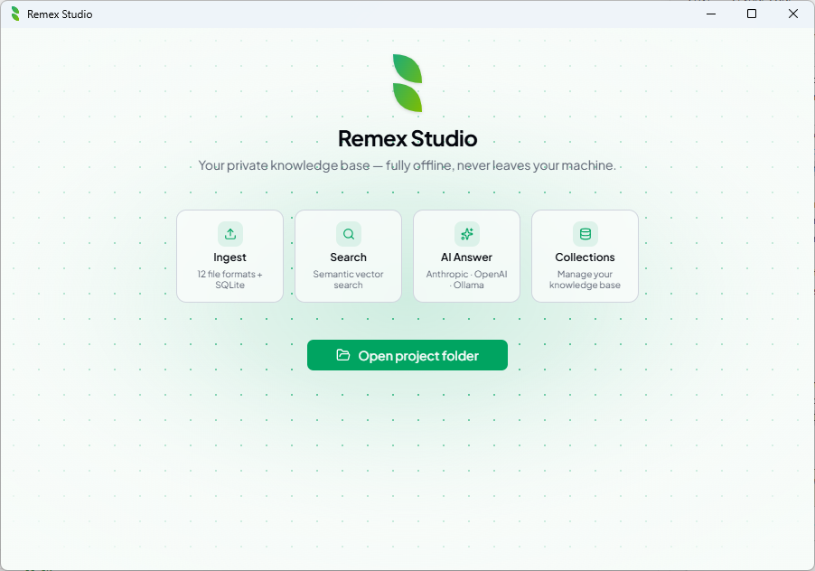
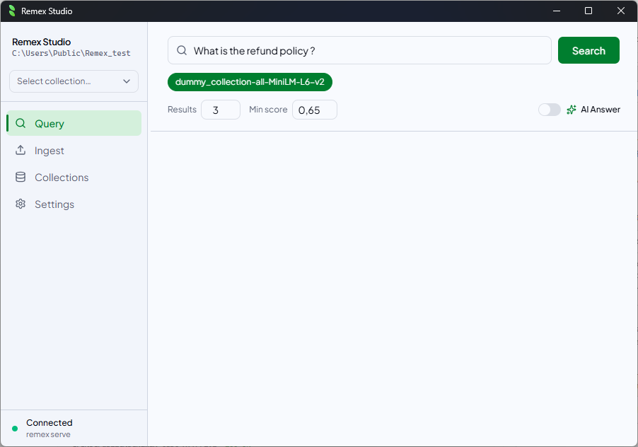
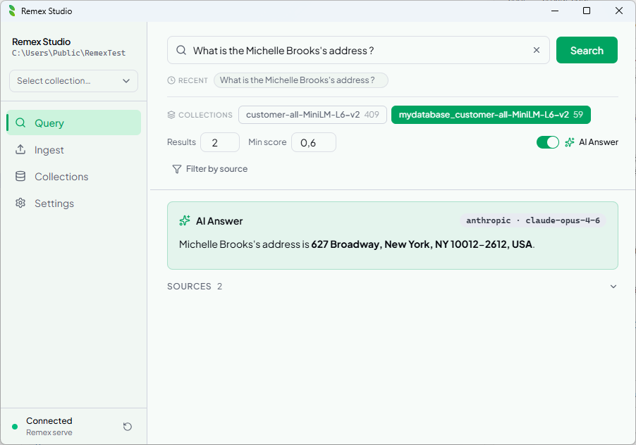

<div align="center">

  <br/><br/>

  # remex

  **Your private knowledge base — fully offline, never leaves your machine.**

  <br/>

  [](LICENSE)
  [](https://github.com/adm-crow/remex/actions)
  [](https://github.com/adm-crow/remex/releases)
  [](https://github.com/adm-crow/remex/releases)
  [](https://github.com/adm-crow/remex/releases)

  <br/>

  

  <br/><br/>

  <table>
    <tr>
      <td align="center">
        <a href="docs/screenshots/remex_query.png">
          
        </a><br/>
        <em>Semantic search</em>
      </td>
      <td align="center">
        <a href="docs/screenshots/remex_ai_answer.png">
          
        </a><br/>
        <em>AI answer</em>
      </td>
    </tr>
    <tr>
      <td align="center">
        <a href="docs/screenshots/remex_ingest.png">
          
        </a><br/>
        <em>File ingestion</em>
      </td>
      <td align="center">
        <a href="docs/screenshots/remex_collection.png">
          
        </a><br/>
        <em>Collections manager</em>
      </td>
    </tr>
  </table>

</div>

---

Remex is a local-first knowledge base for your documents. Point it at any folder — PDFs, notes, code, spreadsheets — and it becomes instantly searchable using natural language. Ask questions and get answers backed by the exact sources in your files, with no data ever leaving your machine.

It runs entirely offline, requires no cloud account, and works with any AI provider you already have — Anthropic, OpenAI, or a local Ollama instance.

---

## Remex Studio

A native desktop app (Windows · macOS · Linux) to ingest, search, and query your documents with AI — no terminal required.

**[Download the latest release →](https://github.com/adm-crow/remex/releases)**

> **Building from source:** see [`studio/README.md`](studio/README.md).

---

## Python CLI

```bash
pip install remex-cli          # core — ingest + query
pip install remex-cli[api]     # adds the FastAPI sidecar (used by Studio)
```

### Quick start

```bash
# 1. Scaffold a project
remex init

# 2. Drop files into docs/ then ingest
remex ingest docs/

# 3. Semantic search
remex query "how does authentication work?"

# 4. AI answer (auto-detects Anthropic / OpenAI / Ollama)
remex query "how does authentication work?" --ai
```

### All commands

| Command | Description |
|:---|:---|
| `remex init [path]` | Scaffold docs/, remex.toml, and .gitignore |
| `remex ingest [dir]` | Ingest files from a directory |
| `remex ingest-sqlite <db>` | Ingest rows from a SQLite table |
| `remex query <text>` | Semantic search (add `--ai` for AI answer) |
| `remex sources` | List all ingested source paths |
| `remex stats` | Show chunk/source counts for a collection |
| `remex delete-source <path>` | Remove all chunks for a source |
| `remex purge` | Remove chunks whose source file no longer exists |
| `remex reset` | Wipe an entire collection |
| `remex list-collections` | List all collections in a database |
| `remex serve` | Start the FastAPI sidecar (used by Studio) |

Use `remex <command> --help` for full option reference.

---

## Features

| | |
|:---|:---|
| **Fully offline** | No data leaves your machine — local embeddings, local storage |
| **12 file formats** | `.pdf` `.docx` `.md` `.txt` `.csv` `.json` `.html` `.pptx` `.xlsx` `.epub` `.odt` `.jsonl` |
| **SQLite ingest** | Embed rows from any table — or all tables at once — alongside your files |
| **Incremental ingest** | SHA-256 hash check — unchanged files are skipped automatically |
| **Batch embedding** | Chunks are embedded in batches for fast ingestion of large directories |
| **AI answers** | Auto-detects Anthropic, OpenAI, or a local Ollama instance |
| **Multi-collection search** | Query across collections, results merged by relevance score |
| **Source filtering** | Narrow query results to a specific file or table |
| **Export results** | Copy or export query results for use elsewhere |
| **Collections manager** | Rename, delete, and inspect your knowledge bases from the UI |
| **Keyboard shortcuts** | Full keyboard navigation — press `?` in Studio for the reference |

---

## Configuration

Place a `remex.toml` in your project root (created by `remex init`):

```toml
[remex]
db             = "./remex_db"
collection     = "remex"
embedding_model = "all-MiniLM-L6-v2"

# chunk_size     = 1000
# overlap        = 200
# min_chunk_size = 50
# chunking       = "word"   # "word" or "sentence"
```

CLI flags always override `remex.toml` values.

---

<div align="center">
  <sub>
    <a href="CHANGELOG.md">Changelog</a> ·
    <a href="CONTRIBUTING.md">Contributing</a> ·
    <a href="LICENSE">Apache 2.0</a> ·
    <a href="https://github.com/adm-crow/remex">GitHub</a>
  </sub>
</div>
