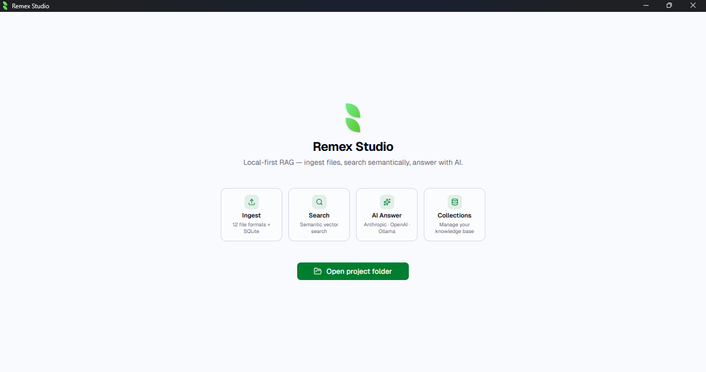
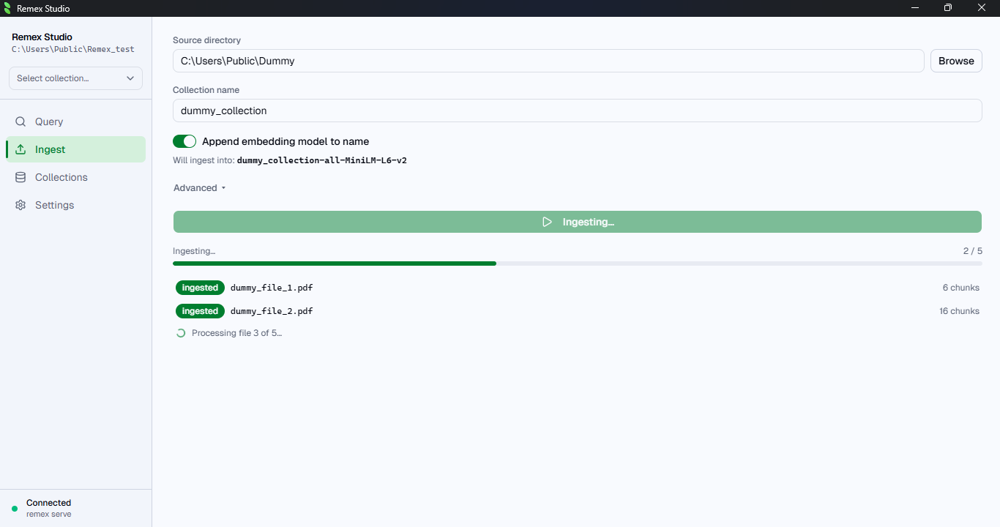
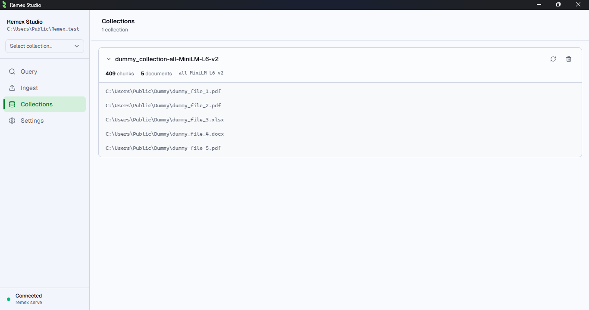
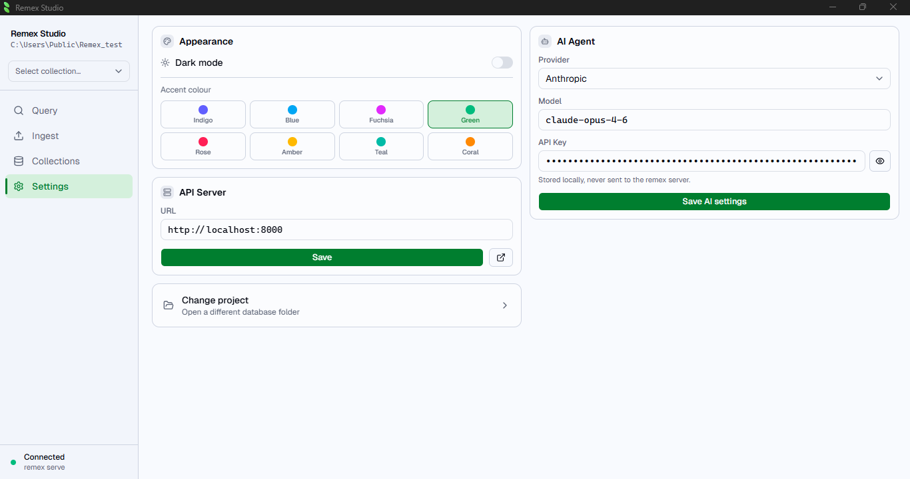

<div align="center">
  <br/><br/>

  # remex

  **Local-first RAG — ingest files, query semantically, feed any AI.**

  <br/>

  [](https://pypi.org/project/remex/)
  [](https://pypi.org/project/remex/)
  [](LICENSE)
  [](https://pypi.org/project/remex/)
  [](https://github.com/adm-crow/remex/actions)

</div>

---

No cloud. No API key required. No infrastructure.

Point remex at a folder — or a SQLite database — and semantically search your documents in seconds, entirely on your machine. Use **Remex Studio** for a visual experience, or the **CLI** for automation and scripting.

---

## Remex Studio

Remex Studio is a native desktop app for ingesting, searching, and querying your documents with AI — all running locally.

<div align="center">
  
</div>

<br/>

<div align="center">
  <table>
    <tr>
      <td></td>
      <td></td>
    </tr>
    <tr>
      <td align="center"><sub>Ingest — live progress, embedding model picker</sub></td>
      <td align="center"><sub>Collections — stats, sources, manage</sub></td>
    </tr>
    <tr>
      <td></td>
      <td></td>
    </tr>
    <tr>
      <td align="center"><sub>Settings — API server, AI provider, theme</sub></td>
      <td></td>
    </tr>
  </table>
</div>

<br/>

| Panel | What it does |
|:------|:-------------|
| **Query** | Semantic search with score filtering. Toggle AI Answer for an LLM-generated response with sources. |
| **Ingest** | Pick a folder, configure chunking and embedding model, watch live progress. |
| **Collections** | Browse collections, view stats, manage sources (delete, purge, reset). |
| **Settings** | API server URL, AI provider / model / key, dark mode, accent colour. |

Studio automatically spawns `remex serve` in the background when it starts. You can also point it at a manually-started server via **Settings → API Server**.

### Install

**Requirements:** Python 3.11+, `remex[api]` on your PATH.

```bash
pip install "remex[api]"
```

Then download and run the Remex Studio installer for your platform.

> **Building from source:** see [`studio/README.md`](studio/README.md).

---

## CLI

The CLI is the fastest way to ingest and query from the terminal, automate workflows, or integrate remex into scripts and CI pipelines.

### Install

```bash
pip install remex
# or
uv add remex
```

<details>
<summary>Optional extras</summary>

```bash
pip install "remex[formats]"   # .html .pptx .xlsx .epub .odt support
pip install "remex[sentence]"  # sentence-aware chunking (NLTK)
pip install "remex[ai]"        # Anthropic + OpenAI SDKs for --ai flag
pip install "remex[api]"       # FastAPI sidecar (remex serve) + Studio
pip install "remex[all]"       # everything
```

</details>

### Quick start

```bash
# One-time project setup
remex init              # creates docs/, remex.toml, .gitignore entry

# Ingest your documents
remex ingest ./docs

# Search
remex query "what is the refund policy?"

# Search with an AI-generated answer
remex query "what is the refund policy?" --ai
```

### Ingest

```bash
remex ingest ./docs
remex ingest ./docs --incremental          # skip files unchanged since last run
remex ingest ./docs --chunking sentence    # sentence-aware splitting
remex ingest ./docs --embedding-model BAAI/bge-large-en-v1.5

# Ingest from a SQLite database
remex ingest-sqlite ./data.db --table articles
remex ingest-sqlite ./data.db --table articles --columns "title,body"
remex ingest-sqlite ./data.db --table articles --row-template "{title}: {body}"
```

### Query

```bash
remex query "refund policy"
remex query "..." -n 10                              # number of results
remex query "..." --min-score 0.6                    # filter by relevance
remex query "..." --format json                      # JSON output for scripting
remex query "..." --collections "docs,archive"       # search multiple collections
remex query "..." --where '{"source_type": {"$eq": "file"}}'

# AI answers (auto-detects provider from env vars)
remex query "..." --ai
remex query "..." --ai --provider anthropic --model claude-opus-4-6
remex query "..." --ai --provider ollama --model llama3
```

### Collection management

```bash
remex sources                    # list all indexed source paths
remex stats                      # chunk count, source count, embedding model
remex purge                      # remove chunks whose source file was deleted
remex delete-source ./docs/old.pdf
remex reset --yes                # wipe the entire collection
remex list-collections           # list all collections in the database
```

### API server

```bash
remex serve                      # start the FastAPI server on localhost:8000
remex serve --host 0.0.0.0 --port 9000
```

The server exposes a REST + SSE API used by Remex Studio. Interactive docs at `http://localhost:8000/docs`.

> Every command accepts `--db PATH`, `--collection NAME`, and `--embedding-model`. Run `remex <cmd> --help` for all options.

---

## Features

| | |
|:---|:---|
| **12 file formats** | `.txt` `.md` `.csv` `.pdf` `.docx` `.json` `.jsonl` `.html` `.pptx` `.xlsx` `.epub` `.odt` |
| **Fully offline** | Local `sentence-transformers` — no data leaves your machine |
| **Persistent storage** | ChromaDB vector store — survives restarts, idempotent upserts |
| **Incremental ingest** | SHA-256 hash check — skip unchanged files on re-run |
| **Streaming** | Large files paged through the chunker — memory stays flat |
| **SQLite ingest** | Embed table rows alongside files in the same collection |
| **Multi-collection query** | Query several collections at once, results merged by score |
| **AI answers** | Auto-detects Anthropic, OpenAI, or a local Ollama instance |
| **remex.toml** | Per-project config file — set defaults once, override with flags |

---

## AI providers

`--ai` auto-detects the provider from your environment:

| Priority | Provider | Activation | Default model |
| :------- | :------- | :--------- | :------------ |
| 1 | **Anthropic** | `ANTHROPIC_API_KEY` set | `claude-sonnet-4-6` |
| 2 | **OpenAI** | `OPENAI_API_KEY` set | `gpt-4o` |
| 3 | **Ollama** | Local server at `http://localhost:11434` | `llama3` |

```bash
# Fully local, no API key needed
ollama serve && ollama pull llama3
remex query "what changed in v2?" --ai --provider ollama --model llama3
```

In Remex Studio, configure the provider, model, and API key in **Settings → AI Agent**.

---

## remex.toml

Run `remex init` once per project. CLI flags always override.

```toml
[remex]
db              = "./remex_db"
collection      = "myproject"
embedding_model = "all-MiniLM-L6-v2"

# chunk_size     = 1000
# overlap        = 200
# min_chunk_size = 50
# chunking       = "word"
```

---

<div align="center">
  <sub>
    <a href="CHANGELOG.md">Changelog</a> ·
    <a href="LICENSE">Apache 2.0</a> ·
    <a href="https://pypi.org/project/remex/">PyPI</a> ·
    <a href="https://github.com/adm-crow/remex">GitHub</a>
  </sub>
</div>
